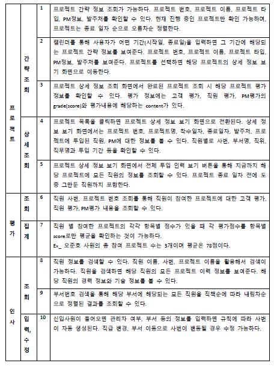

# 개발 언어/환경에 따른 전체 시스템 아키텍처 및 주요 개발 내용

### 목차

1. **Problem Description**
2. **프로젝트 구현 범위**
3. **개발 언어 및 환경**
4. **전체 시스템 아키텍처**
5. **주요 개발 내용**
6. [**산출물**](https://github.com/ddung1203/Database_Project/blob/main/Outputs.md)

### 1. Problem Description

㈜프람트솔루션은 100명의 직원을 둔 SI업체로, 30명의 마케팅, 경영관리 및 연구개발 직원을 제외하면 70명의 개발자가 월 평균 10개 정도의 프로젝트를 수행하고 있다. 개발자들은 프로젝트 에 초기부터 종료 시까지 투입되기도 하고, 프로젝트에 일정 기간 동안만 투입되기도 한다. 프로젝트에 투입되는 개발자들은 경력과 기술 등급에 따라서 PM, PL, 분석자, 설계자, 프로그래머, 테스터 등 다양한 직무를 맡는다.

㈜프람트솔루션이 수행하는 프로젝트에 대해 프로젝트번호, 프로젝트명, 프로젝트 착수일자/종료일자, 발주처 등을 관리하고, 직원들에 대해서는 직원번호, 직원명, 주민등록번호, 최종학력을 관 리하며, 특히 프로젝트 투입 직원들에 대해서는 경력과 경험한 기술(Skill Set)들을 관리하고자 한다. 직원은 회원가입 페이지를 통해 자신의 정보를 데이터베이스에 저장하고 수정 변경할 수 있어야 한다. 직원 사번은 정해진 규칙에 의해서 자동으로 부여하는 것으로 가정하며, 회원가입 시 회원 로그인은 중복 체크 기능을 추가하여 기 등록 된 ID로 회원가입 신청을 할 경우 에러 메시지를 출력하고 중복되지 않는 신규 ID를 입력 할 수 있어야 한다.

경영진은 현재 ㈜프람트솔루션이 몇 개의 프로젝트를 수행하고 있고, 직원들이 현재 어느 프로 젝트에 몇 명이나 투입되어 있으며, 그들이 각각 어떤 직무를 수행하고 있고, 투입기간이 어떻게 되는지 등을 체계적으로 관리하길 원하고 있다. 이를 통해서 과거 특정 시점에 어떤 직원이 어느 프로젝트에 어떤 직무로 참여했었는지도 알 수 있고, 개인별 경력관리는 물론 인센티브 지급을 위한 기초자료까지 추출할 수 있다. 그러므로 경영진은 일반직원과는 다르게 타 직원들의 정보를 검색할 수 있는 권한이 있어야 한다.

직원들이 참여한 각 프로젝트에서는 프로젝트 종료 시점에 평가를 실시한다. 평가에는 고객 평가, PM 평가, 동료평가 등이 존재한다. 각평가는 평가자와 피평가자가 존재하고 평가 항목으로 는 업무수행 평가, 커뮤니케이션 능력평가가 있으며, 각 평가 항목 당 평점과 평가내용을 관리한다. 고객평가는 고객이 프로젝트에 참여한 참여사 직원들에 대해서 평가하는 것을 말한다. 프로젝트를 종료하는 시점에 PM이 주관하여 고객사의 담당자로부터 평가서를 의뢰하고 결과를 회사에 보고해야 한다. 동료평가는 프로젝트에 참여한 각 멤버들이 자기 이외의 프로젝트 참여자에 대해서 평가하는 것이다. 이중에서 PM 평가는 PM이 프로젝트 팀원을 평가하는 것을 말한다. 이러한 평가결과는 회사내부에서 인사고과와 인사평가의 근거 자료로 활용된다.

### 2. 프로젝트 구현 범위

프로젝트 범위를 정하기 위해 요구사항 정의서를 기반으로 프로젝트 정보, 인사, 평가 정보를 조회하고 수정하는 것은 전부 수용을 했으며, 인센티브 지급을 위한 자료 추출에 관한 기능, 로그인 시 비밀번호 찾기 기능, 직원 퇴사 시 로그인 정보 삭제 기능 등은 미수용 했습니다.

회원가입이나 데이터 수정과 같은 기본적인 기능들을 제외하고 수용한 상세범위는 하단의 기능 요구사항 표를 통해 확인 가능 합니다. 직원, 프로젝트 정보를 활용한 검색을 통해 직원, 프로젝트, 평가내용에 해당하는 여러가지 정보들을 조회할 수 있는 각종 기능들과 직급 변경이나 부서 이동시 사번 수정 기능 등을 구현할 범위로 정하였습니다.

**기능 요구사항 표**

### 3. 개발 언어 및 환경

- 데이터베이스 설계 도구: ERWin
- DBMS: MariaDB, MySQL, ClearDB
- 소스코드 관리: Git, Github
- 프로그래밍 언어: Javascript
- 개발 프레임워크: Express.js, React.js, Pug
- 배포(호스팅): Heroku

### 4. 전체 시스템 아키텍처

### 5. 주요 개발 내용

- 데이터베이스는 MariaDB 를 이용하여 구성하였다.
- ERD 로 나타내면 다음과 같다.

- 웹페이지는 로그인 회원가입 부분 인사 관리 , 프로젝트 보기 관리 평가 관리로 크게 구현을 하였다. 회원가입 부분에서 정보를 입력 후 회원가입을 하면 sql 문을 통해 id, 비번 등 개인정보를 데이터베이스에 삽입하고 auto increment 기능을 이용하여 사번을 자동으로 생성하도록 구성하였다.
- 인사 관리 페이지에서 인사 정보 조회를 통해 정보를 검색 할 수 있다. FORM에서 입력을 통해 검색을 하면 sql문을 통해 db에서 관련 정보들을 가져와서 테이블의 형태로 보여준다.
- 인사 관리 페이지에서 부서 정보 조회는 FORM에서 부서번호를 입력받아 검색을 하면 sql문을 통해 부서의 직책순으로 내림차순 정렬을 하여 테이블로 나타낸다. 인사 정보 등록, 수정은 form을 통해 입력을 받아 내용을 db에 삽입 또는 수정하도록 구성하였다.
- 프로젝트 관리 페이지에는 프로젝트 정보 등록,수정,조회의 탭들이 있으며 정보 등록 페이지에는 form을 통해 프로젝트에 대한 정보를 입력 받아 sql문을 통해 db에 저장한다. 정보 수정 페이지 에는 form에서프로젝트에 대한 정보를 입력받으면 해당 프로젝트에 대한 정보와 참여 팀원들을 나타내고 프로젝트에 대한 정보를 수정하면 sql문을 통해 db에 저장한다. Form에서 프로젝트 번호와 직원이름을 검색하면 sql문으로 이름에 해당하는 직원을 보여주고 직무 아이디를 입력하여 해당 프로젝트에 참여직원으로 추가한다.프로젝트 정보 조회 페이지에서는 From에서 프로젝트 번호를 입력 받아 해당 프로젝트가 완료되었으면 sql문을 이용해 고객,pm,직원 평가에 해당하는 내용들을 조회할 수 있다. 해당 프로젝트가 완료되지 않으면 프로젝트에 대한 정보만을 보여준다.
- 프로젝트 보기 탭에는 FORM을 통해 시작일과 종료일 을 입력받으면 sql문을 이용해 프로젝트 간략 정보를 보여주고 프로젝트를 선택하면 상세정보 보기 화면으로 이동한다. 프로젝트 상세 정보에서 프로젝트에 끝까지 참여한 직원들에 대한 정보를 볼 수 있고 버튼을 누르면 중간에 참여를 종료한 직원들까지 볼 수 있다.
- 평가 조회에서는 인사, PM, 동료 평가에 대한 모든 결과를 한번에 조회 가능하다. 평가관리에서는 사번과 프로젝트 번호를 FORM에 입력 받아 조회하면 sql문을 통해 평가들에 대한 정보들을 테이블로 나타낸다. 직원 별로 참여한 프로젝트가 많기 때문에 사번과 프로젝트 번호를 정확히 입력하도록 했다. 각 테이블에 사번사번, 프로젝트 번호 정보로 where절에 조건을 줘서 해당 평가 정보를 보여줬다. 평가 관리에서 평가 항목 평균을 조회 할 수 있는데 form을 통해 사번과 항목을 입력 받으면 sql문의 aggregation함수를 이용하여 이름 총 참여 프로젝트 개수 항목 평균점수를 조회 가능하게 하였다.
